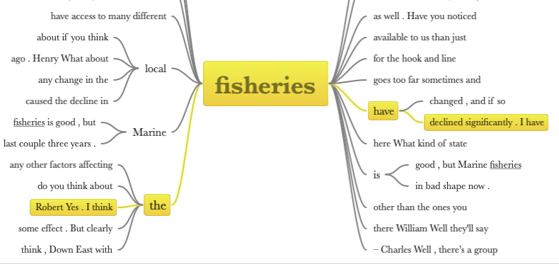

Whether approaching analysis and mining as computer assisted or as automated through algorithms, text analysis can be thought to generally revolve around five core techniques:

* Frequency
* Collocation
* Concordance
* Extraction
* Classification

## Frequency

Frequency is often taken as a guide to significance. Frequency as a tool for analysis is problematized by a couple of factors however.

The first is the relative frequency of words that have no intrinsic meaning--common examples include words like `the`, `be`, `to`, and `of`. Generally, this means that the researcher--or text analysis tool--needs to have a list of words considered insignificant for the task at hand, such that these can be removed from the analysis. This list--referred to as stop words--while frequently standardized in an application, may not translate from one body of texts to another.

Second is the part of speech in which the word is being used. So one can `think`, one `thinks`, but I might be `thinking`. In this case, stemming may be required for frequency to have its intended interpretive relevance.

Third is that frequency provides no window into synonyms and homonyms. Homonyms require more context than a simple word frequency can account for. Synonyms may require a dictionary or forced coercion to highlight concept frequency over word frequency, for example replacing all instances of the word `hound` in a text with `dog`, or to limit duplicate counting `kitty cat` with just `cat`. Synonymity is also context dependent so a single list of synonyms may have limited utility across a series of unrelated texts.

Fourth, frequency relies on breaking sentences into words and decisions need to be made about where and how these breaks occur--spaces, hyphens, apostrophes etc--and what constitutes a meaningful word when punctuation is used, and perhaps independently of any other text, such as with emoticons :)

## Collocation

Word frequency lacks context. Collocation provides a bit more context, by looking at the words adjacent to the primary word of interest. Collocation can be approached in a couple of ways. At its most rich, a search for a word can de shown in context with the words around it. A search for *water* then might return

```html
...protects the environment water quality.

...the highest producing water bodies in North Carolina...
```

One might also run a search for the words on either side of a given word.

```html
environment
quality
producing
bodies
```

In a related way, one may also specifically search for compound terms, commonly referred to as `n-grams`, where `n` represents the number of words in the compound term. Frequencies of `n-grams` can also be searched for, where instead of specifying the terms to find, we get the relative frequency of clusters of terms. A frequency count of proper names in a document then might query it for `bi-grams`.

## Concordance

Whereas collocation is primarily about the positional relationship between words, and as a tool can be applied to a quantitative analysis of a text, concordance is much more rooted in context. And while concordance can help to identify collocation, the process of analyzing concordances is richer still.

A typical display for reading concordances would look something like one of the two following screen captures:


<br /><br />



<br /><br />

## Extraction

Extraction is the process of trying to pull out known entities from a text, whether that be keywords, named entities etc. Extraction is often used to build a data set to be used in another application.

## Classification

Classification is generally used to derive meaning from a text; common classification schemes include sentiment analysis, attempts to identify sarcasm, an emotional ranking of a given piece of text etc. Classification here relies on some aspect of the all the above--synonyms and homonyms, concordance and collocation, and extraction. Classification schemes may be more or less ambiguously articulated by a person and reliant on tools like inter-rater reliability to use effectively, or couched in an algorithm run by a computer application. Generally, in a research context, classification schemes are accompanied by publications articulating how these were derived.

Using sentiment analysis as an example, many dictionaries have been developed. Some simply list positive and negative words, such as the [Opinion Lexicon by Bing Lu](https://www.cs.uic.edu/~liub/FBS/sentiment-analysis.html#lexicon) and looks something like:

| Positive | Negative |
| :--- | :--- |
| abound | 2-faced |
| abounds | 2-faces |
| abundance | abnormal |
| abundant | abolish |
| accessable | abominable |
| accessible | abominably |
| acclaim | abominate |

While others provide weightings, definitions, and rely on some previous analysis of the text for more context, realizing that one word can have multiple meanings, such as the [SentiWordNet dictionary from Andrea Esuli](https://github.com/aesuli/SentiWordNet)

| ID | PosScore | NegScore | SynsetTerms | <span style="display: inline-block; width:400px">Gloss</span> |
| :-- | :-------- | :-------- | :----------- | :----- |
| 00166146 | 0.875 | 0 | attractive#1 | pleasing to the eye or mind especially through beauty or charm; "a remarkably attractive young man"; "an attractive personality"; "attractive clothes"; "a book with attractive illustrations" |
| 00170847 | 0.375 | 0 | attractive#2 | having power to arouse interest; "an attractive opportunity"; "the job is attractive because of the pay" |
